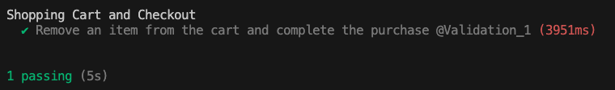
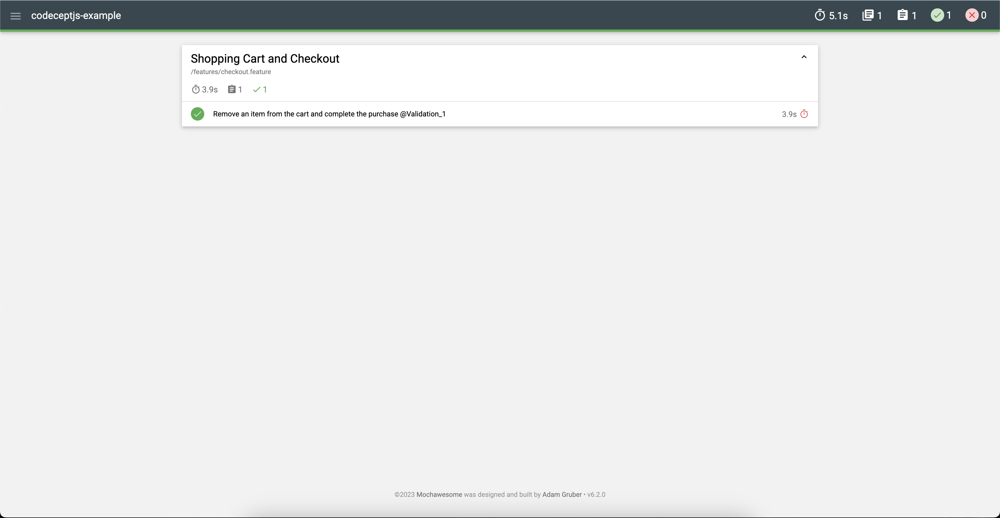

## Run tests
1. `npm install`
2. `npx codeceptjs run --features`

### Run tests with html reporter
`npx codeceptjs run --features --steps --reporter mochawesome`

# Results
After tests run you should see:
 - Information in console with tests rresults 
 - If you run tests with html report generation, you should have `./output/mochawesome.html` file which you can open in your browser 

## Writting tests
To implement new test cases you need:
1. Create new `[name].feature` in `./features` (How to write features in Gherkin language: `https://cucumber.io/docs/gherkin/`)
2. Create steps file `[name].steps.ts` in `./step_definitions` and run: `npx codeceptjs gherkin:snippets [--path=PATH] [--feature=PATH]` to generate steps.
3. Fill steps by code.
4. If you crated pages in `./pages`:
   1. add this files to `include` section at `codecept.conf.ts`.
   2. run: `npx codeceptjs def` to update defenitions in `steps.d.ts`

## Usefull commands

1. List steps: `npx codeceptjs gherkin:steps`
2. Use grep to find steps in a list (grep works on Linux & MacOS):
`npx codeceptjs gherkin:steps | grep user`

